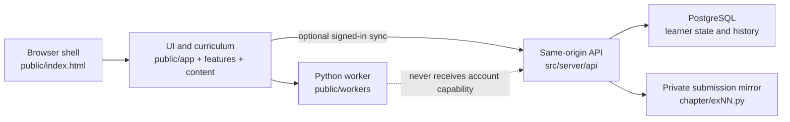

# Repository architecture

Python EduGround is organized around one rule: a file's directory should explain
its audience and responsibility before the file is opened.

- `public/` is the only browser-downloadable tree.
- `src/server/` is the application server.
- `curriculum/` contains private source material used to build and validate the
  public learning experience.
- `database/` owns persistent schema and role definitions.
- `scripts/` contains maintainer commands, grouped by purpose.
- `tests/` mirrors the system's client, server, integration, and browser
  boundaries.

The structure validator fails when a root-level implementation file, a non-vendor
`.mjs` file, or a private solution appears in a public path.

## Top-level map

```text
.
├── public/                     # Only HTTP-served directory
│   ├── index.html              # Stable browser shell and script order
│   ├── app/                    # Cross-feature browser orchestration
│   ├── assets/                 # Images, diagrams, and vendored Ace
│   ├── content/                # Solution-free authored/generated learning data
│   │   ├── exercise-tests/     # Browser learning checks
│   │   └── generated/          # Solution-free generated starters
│   ├── features/               # Vertical UI features
│   ├── styles/                 # Shared design system
│   └── workers/                # Browser Python execution worker
├── src/
│   └── server/
│       ├── api/                # Same-origin HTTP API
│       ├── curriculum/         # Exercise manifest and submission mirror
│       ├── http/               # Static files and response helpers
│       ├── persistence/        # PostgreSQL, migrations, learner state
│       ├── security/           # Authentication and runtime policy
│       ├── main.js             # Process entrypoint
│       └── paths.js            # Canonical absolute repository paths
├── curriculum/
│   ├── solutions/              # Private Python reference implementations
│   └── generated/              # Private generated solution bundle
├── database/
│   ├── bootstrap/              # Restricted runtime-role grants
│   └── migrations/             # Ordered, checksum-protected schema changes
├── scripts/
│   ├── build/                  # Generated and vendored artifacts
│   ├── database/               # Migration, backup, restore, secrets
│   ├── lib/                    # Shared maintainer-script paths
│   ├── maintenance/            # Safe workspace cleanup
│   └── validation/             # Repository quality gates
├── tests/
│   ├── e2e/                    # Chromium learner journeys and accessibility
│   ├── integration/            # Real PostgreSQL behavior
│   └── unit/
│       ├── client/             # Browser models, data, and render contracts
│       └── server/             # HTTP, persistence, and security units
├── docs/                       # Product, operator, and maintainer guides
├── artifacts/                  # Git-ignored generated test evidence
├── Dockerfile
├── docker-compose.yml
├── package.json
└── playwright.config.js
```

Root is reserved for files that define the repository as a whole: package
metadata, container topology, test configuration, security policy, and entry
documentation. Product implementation does not belong at root.

## Browser application

### Public boundary

`src/server/http/static-files.js` resolves browser requests strictly below
`public/`. It rejects traversal, symlink escapes, non-files, and private repository
paths. The production image copies the same `public/` tree, so local and container
serving have one boundary.

These files must never be placed in `public/`:

- Python reference solutions or generated answer bundles;
- database migrations or credentials;
- server modules or operational scripts;
- test fixtures that reveal private reference implementations;
- learner submission mirrors.

### Browser responsibilities

`public/app/` is for behavior used across several screens:

- `course-app.js` owns routing, application state, persistence integration,
  editor/runner coordination, and shared rendering;
- `audio-feedback.js` owns synthesized action cues;
- `theme-bootstrap.js` applies the saved theme before the full app renders;
- `solution-shape.js` evaluates educational source-shape contracts.

`public/features/<feature>/` is for a cohesive screen or interaction. Its
JavaScript and feature-specific CSS stay together. Current examples include
`landing`, `dashboard`, `classroom`, `assessment`, and `stage-recap`.

`public/content/` contains immutable, solution-free data consumed by the browser.
It is separate from UI behavior so authoring validation can inspect the curriculum
without rendering a page.

`public/styles/` contains styles that cross feature boundaries. A selector used
only by one feature belongs beside that feature instead.

### JavaScript convention

The package uses `"type": "module"`, so Node server, script, and test files are
standard ESM `.js` files. The browser application intentionally remains a small
ordered classic-script system: `public/index.html` loads browser `.js` files in a
documented order and those files publish frozen namespaces on `window`.

Consequently:

- use `.js`, not `.mjs`, for project-owned JavaScript;
- use `import`/`export` in Node code;
- preserve the script order in `public/index.html` for classic browser code;
- do not add a bundler merely to place a file in the correct directory;
- place third-party code only below `public/assets/vendor/`, with its license.

## Server application

`src/server/main.js` composes the process. Domain modules point inward to small
helpers and never reach into test or documentation directories.

| Area | Owns |
| --- | --- |
| `api/` | URL routing, request bounds, same-origin API responses |
| `curriculum/` | Stable exercise-to-file mapping and private saved-file mirror |
| `http/` | Static file resolution, MIME types, security headers, JSON responses |
| `persistence/` | Database configuration, migration loading, state and run records |
| `security/` | Passwords, cookies, tab capability, origin/CSP/proxy policy |
| `paths.js` | Resolved public, migration, and repository roots |

The API runs learner Python nowhere on the server. Python remains inside the
dedicated browser worker. The server accepts bounded learner state and run evidence
for optional account sync.

## Curriculum and generated artifacts

The curriculum has two deliberately different halves:

```text
private inputs                         browser-safe outputs
curriculum/solutions/**/*.py
        │
        ├── build:solutions ────────> curriculum/generated/solution-code.js
        │                              (private validation artifact)
        │
        └── build:starters ─────────> public/content/generated/starter-code.js
                                       (solution-free browser artifact)
```

`public/content/exercise-data.js` retains stable chapter IDs, exercise IDs, and
the original relative solution source labels used by validation. Moving files does
not change learner identifiers.

After changing a reference solution, run:

```bash
npm run build:solutions
npm run build:starters
npm run validate:content
```

Review both generated diffs. A public starter must not reveal the implementation.

## Persistence and compatibility contracts

Repository organization must not silently reset learner work. These identifiers
are compatibility contracts:

- URL hash routes such as `#chapter/py01/tutorials` and
  `#exercise/py01-first-programs`;
- chapter and exercise IDs;
- local/session storage keys and their account scopes;
- API URLs, cookie names, and tab-capability behavior;
- PostgreSQL migration names and checksums;
- submission mirror paths such as `Py01 First Programs/ex00.py`;
- public starter and test lookup keys.

The file migration changed none of these identifiers and requires no database
migration. Progress stored on the same browser origin remains available; signed-in
progress remains attached to the same PostgreSQL database.

## Database ownership

`database/migrations/` is append-only after deployment. Never edit the contents of
an already-applied migration; add the next numbered file and update the migration
manifest through the existing workflow.

`database/bootstrap/app-role.sql` grants the long-running application only the
operations it needs. Database-owner credentials belong to migration/bootstrap
jobs, not the application container.

See [PERSISTENCE.md](PERSISTENCE.md) and [DEPLOYMENT.md](DEPLOYMENT.md) before
changing schema, state merge rules, credentials, or backup behavior.

## Where a change belongs

| Change | Primary location | Expected tests |
| --- | --- | --- |
| New browser-wide behavior | `public/app/` | `tests/unit/client/`, relevant E2E |
| New screen or focused interaction | `public/features/<name>/` | feature unit/E2E |
| Shared visual token or layout | `public/styles/` | responsive/accessibility E2E |
| Chapter prose or runbook | `public/content/` | content validators, classroom E2E |
| Exercise checks | `public/content/exercise-tests/` | content validation, exercise E2E |
| Server route | `src/server/api/` | server unit, integration, E2E as needed |
| Auth/origin/cookie policy | `src/server/security/` | security unit and browser gates |
| PostgreSQL behavior | `src/server/persistence/`, `database/` | unit and integration |
| Maintainer command | matching `scripts/<purpose>/` directory | syntax and focused test |
| Documentation only | `docs/` plus README link if discoverability matters | link/structure checks |

Do not create a new top-level folder until its ownership cannot be expressed by an
existing boundary.

## Runtime flow



The dotted edge is denied by design: worker-originated requests do not possess the
tab-only account capability.

## Validation layers

Run the deterministic gate before every commit:

```bash
npm run validate
git diff --check
```

The gate includes:

1. structure boundaries and prohibited flat files;
2. syntax across organized source trees;
3. curriculum, starter, assessment, and documentation contracts;
4. client and server unit tests;
5. security, public-file, workflow, and container policy checks.

UI changes additionally require:

```bash
npm run validate:browser
```

Persistence changes require an isolated PostgreSQL database and:

```bash
npm run validate:integration
```

Release candidates use the complete flow documented in
[SECURE_SDLC.md](SECURE_SDLC.md).
